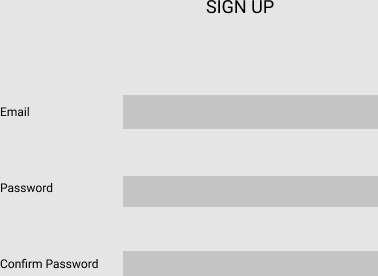
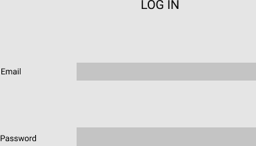
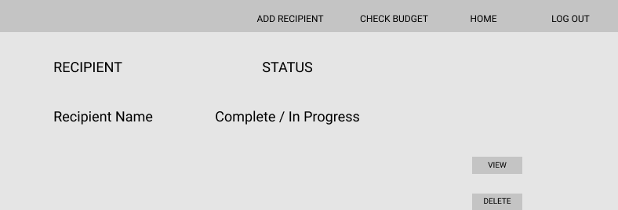
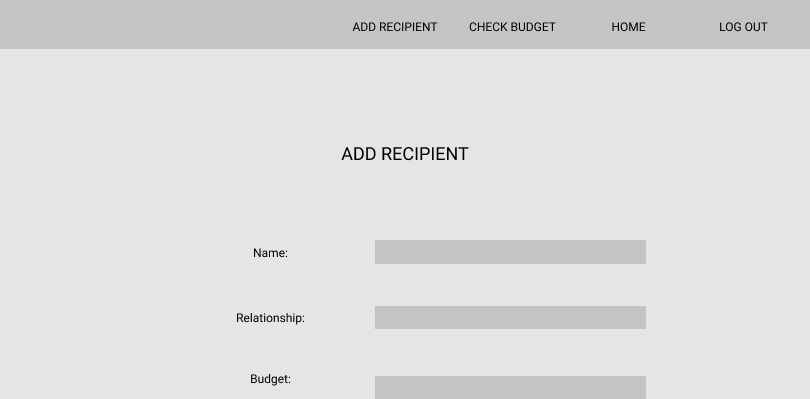
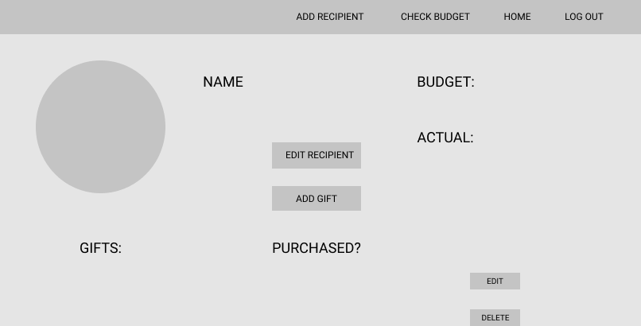
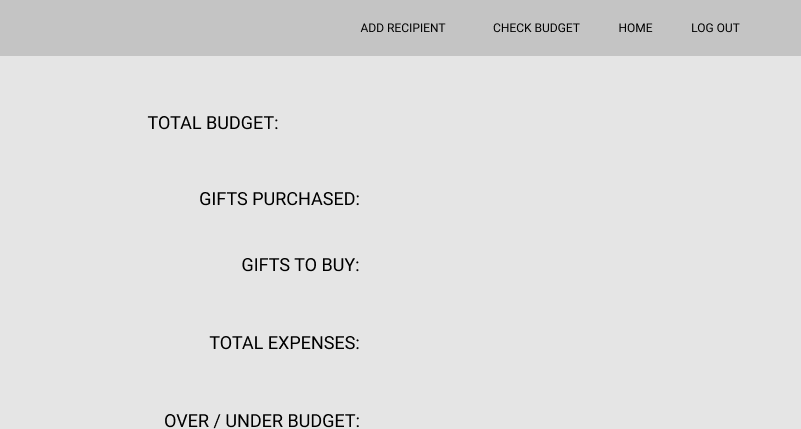
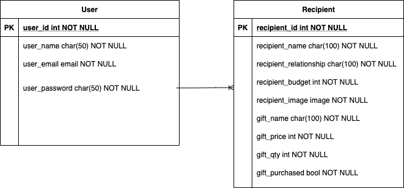

# Gift Tracker
## What is Gift Tracker?
Need an easy way to track who you are purchasing gifts for those special moments and holidays?  Looking for a fast way to track how you are spending compared to what you budgeted? Look no further than Gift Tracker; the one stop shop for tracking who you are spending money on and how much you are spending.  Get rid of boring spreadsheets and say hello to Gift Tracker.

## User Stories

```
As a user, I can quickly create a secure account using basic information, such as email and password. 

As a user, I can see a dashboard of all people I plan to purchase gifts from, to determine if any 
additional people need to be added to the list. 

As a user, I am provided a link from the dashboard to quickly and easily add new people I
intend to purchase gifts. From the dashboard, I have the ability to view the recipient page or
remove recipient, as necessary.

As a user, I am provided a unique page by recipient, that displays budgeted amount and actual
amount spent on gifts.

As a user, I am provided a listing of gifts that I intend or have purchased, as well as the ability
to edit the status of the gift or delete the gift, as necessary.

As a user, I am provided graphaical statistics of my overall budgeted vs. actual amount spent.

As a user, I am provided a home and about page that explains the background of the app and 
how to use the app.

```

## Wireframes

Home Page - Landing page to welcome users

Signup 

Login

Main Page - Page listing all recipients and buttons to view or delete recipients

Add Recipient

Show Page - Page showing individual recipient, with image and gifts to purchase/purchased

Budget Page - Page showing total budget to actual for the user

About Page - Page giving background information about application


## Data Models



## Milestones

```
Create Models/Schemas
Create Backend (Server)
Create API Routes for User, Recipients
Create User Authentication
Create Connect with Cloudinary
Create React Routes
Create Register and Login forms; front end User Auth
Create Main Page for Recipients 
Create Show Page for Recipients
Create Forms to Add / Edit Recipients
Create Home and About Pages
Create Forms to Add / Edit Gifts - Stretch
Create Budget to Actual Chart - Stretch

```

## Dependencies Installed

```
axios
bcryptjs
body-parser
cloudinary
config
cors
dotenv
express
express-validator
jsonwebtoken
materialize-css
mongoose
multer
multer-storage-cloudinary
react-chartjs-2
react-redux
react-router-dom
redux
redux-devtools-extension
uuid

```

## Technologies
Frontend - React, Materialize, CSS
Backend - Mongoose, Express, Node
Database - MongoDB